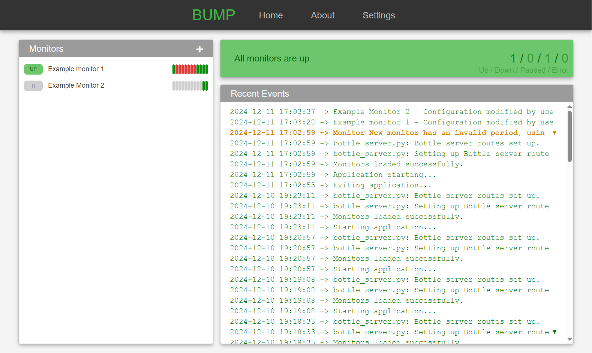
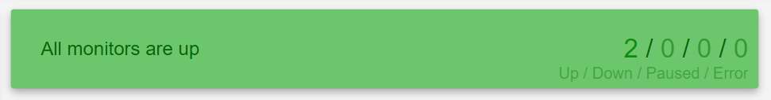
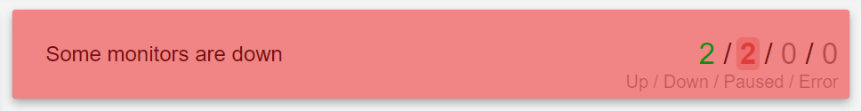
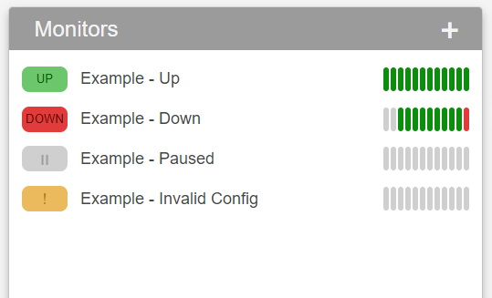

# GUI and Interface

BUMP features a simple GUI designed to provide easy access to all monitoring functions running in the background.

---

## Process, Tray Icon and GUI
- **Background Execution**:
    - The monitoring side of the application runs silently in the background, as indicated by the tray icon.
    - Opening or closing the GUI has no impact on the background tasks.
- **Accessing the GUI**:
    - Click the tray icon to open the interface.
- **Exiting the Application**:
    - Right-click the tray icon and select **"Exit"** to close the app entirely.

---

## The Dashboard

The GUI opens on the dashboard, providing an overview of your entire setup. It includes key sections to help you quickly assess the state of your monitors and recent activity.

{ width="600" }

### 1. Summary Card
The summary card offers a high-level snapshot of all your monitors:

- **Overall Status**:
    - Displays an overall assessment (e.g. if all monitors are up, if some are down, if errors were encoutered...)
    - E.g. If all monitors are up
        { width="600" }
    - E.g. If some monitors are down
        { width="600" }
- **Monitor Counts**:
    - Breaks down the total number of monitors into categories:
        - **Up**: Monitors currently passing their conditions.
        - **Down**: Monitors failing their conditions.
        - **Paused**: Monitors not actively running checks.
        - **Error**: Monitors with invalid configurations or queries that failed to execute.

### 2. Recent Events
The **Recent Events** section provides a quick preview of all notable application and monitor events, such as:

- **Monitor Status Changes**:
    - Notifications when monitors transition between states (e.g., from "Up" to "Down").
- **Application Events and Errors**:
    - Alerts or system-level changes that may impact monitoring.

### 3. Monitor List
The monitor list is the core interface for viewing and managing individual monitors. Each monitor is displayed with key indicators and a graphical summary of recent results.

{ width="400" }

- **Status Icon (left)**:
    - Color-coded icons indicate the current state of each monitor:
        - **Green**: Monitor is **Up**.
        - **Red**: Monitor is **Down**.
        - **Grey**: Monitor is **Paused**.
        - **Yellow**: Monitor is in an **Error** state.
- **Bar Graph (right)**:
    - A series of vertical bars visually represent the results of the monitor's recent queries:
        - **Green Bars**: Successful queries.
        - **Red Bars**: Failed queries.
        - **Grey Bars**: Queries that have not yet run.
    - The bar graph provides an at-a-glance history of a monitor’s performance.
