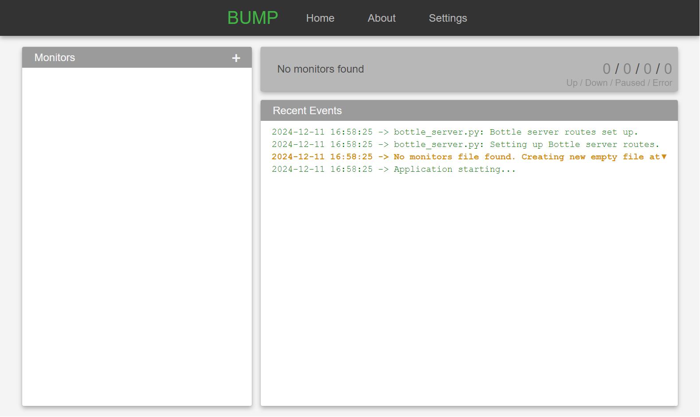
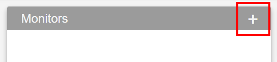

# Basic Usage Guide

This guide provides a quick overview of the basic features to get your started.

---

## Launching the Application
1. **From Source**:
    - Navigate to the project directory.
    - Start the application by running:
     ```bash
     python src/app.py
     ```

2. **Using the Pre-Bundled Executable**:
    - Double-click the executable file to launch the application.

This will open the BUMP interface in a window and add a tray icon, as the process still runs in the background when the interface is closed.

{ width="600" }

---

## Opening the GUI
- Click the tray icon to open the GUI that allows you to add, edit and remove monitors as well as view their status and history, and change application settings.

## Closing the application
- BUMP keeps running in the background even when you close the GUI.
- Right-click the system tray icon and select "Exit" to fully close the application.


## Adding a Monitor

1. **Create a New Monitor**
    - Click the **"+"** button on the "Monitors" card on the dashboard.
         { width="400" }


2. **Fill in the Details**:
    - Fill in the relevant and required fields in the **"Monitor Settings"** panel on the right.
    - **Name**: Uniquely identifies the monitor and serves as the display name.
    - **URL**: The URL of the resource you want to monitor.
    - **Timeout**: Time (in seconds) to wait for a response from the monitored resource before considering it down.
    - **Interval**: Seconds to wait between verifications (values smaller than the application's **"Monitoring Interval"** will have no additional effect)
    - **Query Type**: The type of verification to run on the resource. For details on available conditions, see [Query Types](queries.md)

3. **Save the Monitor**:
    - Click **"✔ Apply"** to update the resource and begin monitoring.

Note that invalid configurations will prevent changes from being saved.

---

## Viewing Monitoring Data
1. **Dashboard**:
    - The main dashboard displays the current status of all monitored resources.
    - Color codes indicate whether resources are up, down, or experiencing issues.
    - The vertical bars next to a monitor in the list indicate the result of the latest queries.

2. **Details Page**:
    - Click on a resource in the dashboard to view detailed information, including:
        - Statistics.
        - Timeline of results.
        - Event logs.

---

## Modifying a Monitor
1. **Select a Monitor**:
    - Click the resource you want to modify from the dashboard.

2. **Click ✎ Edit**:
    - At the top of the right panel, click **"✎ Edit"**
    - You will be presented with the **"Monitor Settings"** panel

2. **Edit Settings**:
    - Adjust the settings as needed.

3. **Save Changes**:
    - Click **"✔ Apply"** to save the changes made.

Note: You can also access the monitors configurations at **"./data/monitors.json"**. Invalid configurations can prevent the application from launching or operating properly.

---

## Running a Verification Manually
1. **Select a Monitor**:
    - Click the resource you want to modify from the dashboard.

2. **Click (↺ Check Now)**:
    - At the top of the right panel, click **"↺ Check Now"**.

3. **Trigger Verification**:
    - This will immediately run the monitoring test for the selected resource, displaying updated results in the details panel.

**Note**:
    - This bypasses the monitor and application's interval settings.

---

## Pausing / Unpausing a Monitor
1. **Select a Monitor**:
    - Click the resource you want to modify from the dashboard.

2. **Click "❙❙ Pause" / "⏵ Resume"**:
    - At the top of the right panel, click **"❙❙ Pause"** to suspend monitoring or **"⏵ Resume"** to reactivate it.

**Note**:
    - Paused monitors do not execute and are not accounted for in general monitor status (e.g. they do not influence the tray icon state or the summary card on the dashboard)

---

## Duplicating a Monitor
1. **Select a Monitor**:
    - Click the resource you want to modify from the dashboard.

2. **Click (⧉ Duplicate)**:
    - At the top of the right panel, click **"⧉ Duplicate"**.

3. **Edit the New Monitor**:
    - A duplicate of the monitor will be created, and the **Monitor Settings** panel will open, allowing you to adjust the settings for the new resource.

---

## Removing a Monitor
1. **Select a Monitor**:
    - Click the resource you want to modify from the dashboard.

2. **Click (✕ Delete)**:
    - At the top of the right panel, click **"✕ Delete"**.

3. **Confirm Deletion**:
    - A confirmation dialog will appear. Click **"Yes"** to delete the monitor permanently or **"No"** to cancel.
    - This cannot be undone.

---

## Reviewing Logs and History
1. **Logs**:
    - A preview of the various events is displayed on the dashboard.
    - Complete logs can be found at **"./logs"**
    - Monitor history can be found at **"./data/history"**

2. **Timeline And Monitor Events**:
    - Click on a monitor from the dashboard to see its details, timeline and a preview of its log.
